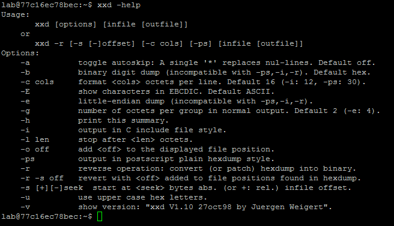

# 安全連線:
### windows:putty

### Linux ssh
# 第一題
BreakALLCTF{Sobkjgd14VuIFBUtgVts}
30622 陳信宇
# 第二題
BreakALLCTF{WucLSg4cxPNYuXFF5XxJ}
30622 陳信宇
# 第三題
BreakALLCTF{GIUWO1rpMhJCJpACvVwr}
30622 陳信宇
# 第四題
BreakALLCTF{XvXeVX5Ae9FwnYmDV2jU}
30622 陳信宇
# 第五題
BreakALLCTF{TPLGKbWxmutGtecSSpo1}
30622 陳信宇
# 第六題
BreakALLCTF{YUA7D5D0k4elbQ1XqH14}
30622 陳信宇
# 第七題
BreakALLCTF{Ef94iSQPRI66Ws4ECqV9}
30622 陳信宇
# 第八題
BreakALLCTF{U6TLCzQsk73HwcW7rqAW}
30622 陳信宇
# 第九題
BreakALLCTF{UvB3IUqxCCiTVxeOuWrL}
30622 陳信宇
# 第十題
BreakALLCTF{VLJekKONoWld7ari6HHJ}
30622 陳信宇
